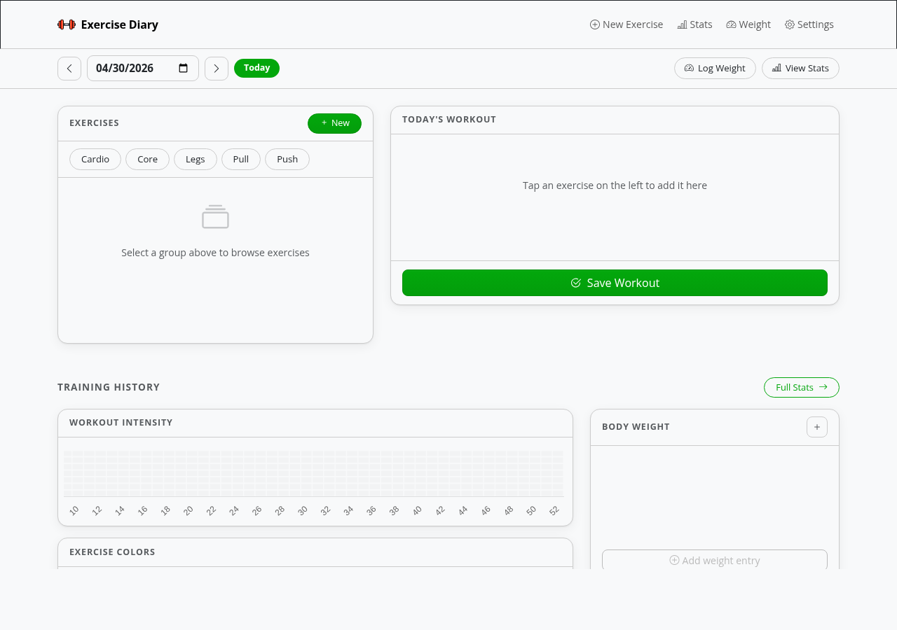

[](https://github.com/rwlove/ExerciseDiary/actions/workflows/container-publish.yml)
[](https://goreportcard.com/report/github.com/aceberg/exercisediary)

<h1><a href="https://github.com/rwlove/ExerciseDiary">
    
</a>Exercise Diary</h1>

Workout diary with GitHub-style year visualization. Log daily sets, track body weight, and visualize training history with intensity heatmaps.

- [Architecture](#architecture)
- [Quick start](#quick-start)
- [Configuration](#configuration)
- [API server options](#api-server-options)
- [Frontend options](#frontend-options)
- [Local network only](#local-network-only)
- [Thanks](#thanks)



## Architecture

Exercise Diary runs as two independent services:

```
┌──────────────────────────┐        ┌──────────────────────────┐
│  exercisediary-frontend  │─HTTP──▶│  exercisediary-api       │
│  Web UI  (default :8080) │        │  JSON API  (default :8851│
└──────────────────────────┘        └───────────┬──────────────┘
                                                 │
                                            SQLite DB
```

| Service | Image | Description |
|---|---|---|
| API backend | `ghcr.io/rwlove/exercisediary-api` | Owns the SQLite database, exposes a JSON REST API |
| Web frontend | `ghcr.io/rwlove/exercisediary-frontend` | Serves the browser UI, talks to the API over HTTP |

## Quick start

```sh
docker compose up
```

Or run each service manually:

```sh
# Start the API backend (stores data in /data/ExerciseDiary)
docker run --name exdiary-api \
  -v ~/.dockerdata/ExerciseDiary:/data/ExerciseDiary \
  -p 8851:8851 \
  ghcr.io/rwlove/exercisediary-api

# Start the web frontend
docker run --name exdiary-frontend \
  -p 8080:8080 \
  ghcr.io/rwlove/exercisediary-frontend \
  -a http://<YOUR_HOST_IP>:8851
```

Then open **http://localhost:8080** in your browser.

## Configuration

Configuration is read from `config.yaml` or environment variables on the **API** server.

| Variable | Description | Default |
|---|---|---|
| `AUTH` | Enable session-cookie authentication | `false` |
| `AUTH_EXPIRE` | Session expiration: number + suffix `m`, `h`, `d`, or `M` | `7d` |
| `AUTH_USER` | Username | `""` |
| `AUTH_PASSWORD` | bcrypt-hashed password — [how to generate](docs/BCRYPT.md) | `""` |
| `HOST` | Listen address | `0.0.0.0` |
| `PORT` | API listen port | `8851` |
| `THEME` | Any [Bootswatch](https://bootswatch.com) theme name (lowercase) or extras: `emerald`, `grass`, `grayscale`, `ocean`, `sand`, `wood` | `grass` |
| `COLOR` | Background: `light` or `dark` | `light` |
| `HEATCOLOR` | Heatmap cell color | `#03a70c` |
| `PAGESTEP` | Rows per page | `10` |
| `TZ` | Timezone (required for correct date display) | `""` |

## API server options

| Flag | Description | Default |
|---|---|---|
| `-d` | Path to data/config directory | `/data/ExerciseDiary` |
| `-p` | Port to listen on | `8851` |
| `-k` | API key required on `X-Api-Key` header (empty = no auth) | `""` |

## Frontend options

| Flag | Description | Default |
|---|---|---|
| `-a` | Base URL of the API server | `http://localhost:8851` |
| `-p` | Port to listen on | `8080` |
| `-k` | API key sent to the API server | `""` |
| `-n` | Path to local node_modules ([node-bootstrap](https://github.com/aceberg/my-dockerfiles/tree/main/node-bootstrap)) | `""` |

## Local network only

By default the app loads themes, icons, and fonts from the internet. For an air-gapped setup, run the [node-bootstrap](https://github.com/aceberg/my-dockerfiles/tree/main/node-bootstrap) sidecar and pass its URL to the frontend via `-n`:

```sh
docker run --name node-bootstrap \
  -v ~/.dockerdata/icons:/app/icons \
  -p 8850:8850 \
  aceberg/node-bootstrap

docker run --name exdiary-frontend \
  -p 8080:8080 \
  ghcr.io/rwlove/exercisediary-frontend \
  -a http://<YOUR_HOST_IP>:8851 \
  -n http://<YOUR_HOST_IP>:8850
```

Or use [docker-compose-local.yml](docker-compose-local.yml) to build both images from source.

## Thanks

- All Go packages listed in [dependencies](https://github.com/aceberg/exercisediary/network/dependencies)
- [Bootstrap](https://getbootstrap.com/) and [Bootswatch](https://bootswatch.com) themes
- [Chart.js](https://github.com/chartjs/Chart.js) and [chartjs-chart-matrix](https://github.com/kurkle/chartjs-chart-matrix)
- Favicon and logo: [Flaticon](https://www.flaticon.com/icons/)
